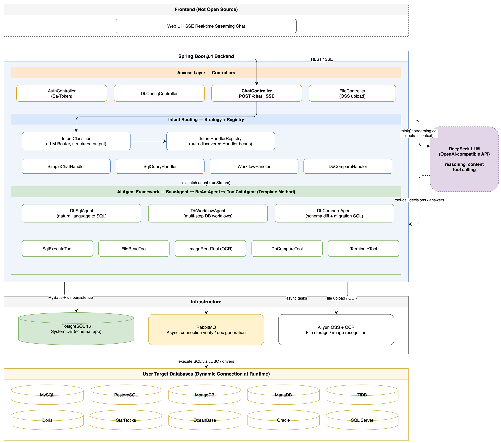
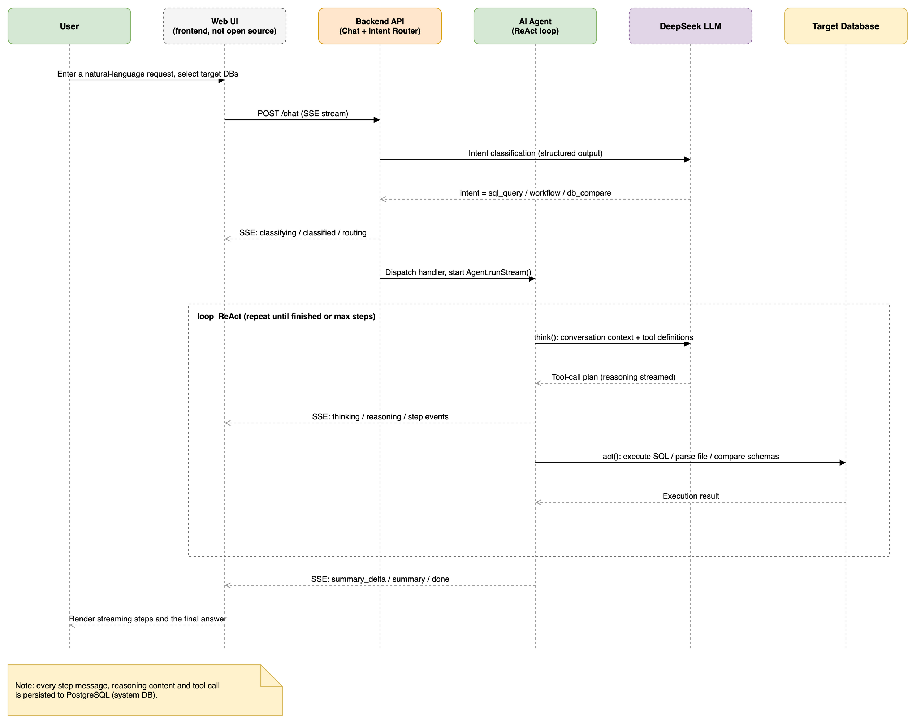

# DB-Genius — AI Database Master

**English** | [中文文档](README.zh-CN.md)

> Talk to your databases in natural language: query, import, and compare — from a single web page.

DB-Genius is an open-source, AI-agent-driven database workbench. It turns natural language into SQL, runs multi-step database workflows, generates migration SQL for releases, and imports data from uploaded files — across **many heterogeneous databases at once**.

---

## 1. Introduction

### The pain points

Teams that operate several large databases — often of **different engines** (MySQL, PostgreSQL, Oracle, SQL Server, Doris, …) — keep paying the same taxes every day:

- **Context switching**: every engine has its own client, dialect quirks, and credentials. Engineers juggle five tools just to answer one business question.
- **Release risk**: before a production release, someone must diff the *pre* database against the *production* database by hand and write the migration SQL — slow, error-prone, and never fully trusted.
- **Data onboarding**: business data arrives as Excel/CSV files or even screenshots; turning them into `CREATE TABLE` + `INSERT` scripts is pure manual labor.

### What DB-Genius does

DB-Genius puts all of that behind **one chat box on one web page**:

| Capability | What you say | What happens |
|------------|--------------|--------------|
| Natural-language SQL | "How many orders were placed last week?" | The AI agent generates SQL, executes it against the selected databases, and streams the result back with an explanation. |
| Multi-database control | "Compare the user table in DB A and DB B" | One session can address many user-managed databases of different engines simultaneously. |
| Release diff & migration SQL | "Diff the pre DB against production and give me the migration script" | The compare agent extracts metadata from both sides, diffs structures, and generates a deployment-ready migration SQL document. |
| File-to-database import | "Import this Excel into a new table" | Upload a file (or an image — OCR is supported); the workflow agent parses it and generates + executes the import SQL. |

Everything is streamed to the browser in real time over **SSE** — every reasoning step, every tool call, every SQL result is visible while the agent works.

### Technical architecture



Key design points:

- **Two database roles.** PostgreSQL 16 is the *system* database (users, db configs, conversations, schema `app`). User-managed *target* databases are connected dynamically at runtime through a `DbType` + `DatabaseAdapter` registry.
- **LLM intent routing.** `IntentClassifier` (structured LLM output) → `IntentHandlerRegistry` (Strategy + Registry, auto-discovered `IntentHandler` beans). New intents are just new beans.
- **Template-method agent framework.** `BaseAgent → ReActAgent → ToolCallAgent`, with concrete `DbSqlAgent`, `DbWorkflowAgent`, `DbCompareAgent`. `think()` streams model reasoning as SSE `reasoning` events; `act()` executes tools.
- **Bounded tool output.** Oversized tool results are truncated structurally (row sets are trimmed row-by-row so the payload stays valid JSON) and the full text is parked in a per-task artifact store; the model can page it back with `readToolOutput(artifactId, offset, limit)` instead of blindly re-running the same query. Every database statement runs under a query timeout.
- **Tiered in-run context compaction.** Inside a single agent run the context is first slimmed deterministically — stale tool observations are replaced by a placeholder that still carries a retrieval handle (zero LLM calls, sub-millisecond). Only if that is not enough does it escalate to an LLM summary of the earliest steps. Both tiers stream a `context_compact` SSE event, so compaction is visible rather than an unexplained pause.
- **Loop breaker.** Identical tool calls are counted; the third one is blocked with actionable guidance instead of being executed, and past the hard-stop threshold the agent is steered straight to `doTerminate` with `maxSteps` converged — it still finishes through the normal summary path rather than erroring out.
- **Async backbone.** RabbitMQ drives async connection verification and schema-doc generation; Aliyun OSS stores uploaded files; credentials are encrypted with AES-256-GCM.

### Supported target databases

| Type | `dbType` | Notes |
|------|----------|-------|
| MySQL | `mysql` | |
| PostgreSQL | `postgresql` | |
| MongoDB | `mongodb` | Non-SQL, JSON commands |
| MariaDB | `mariadb` | MySQL protocol |
| TiDB | `tidb` | MySQL protocol |
| Doris | `doris` | MySQL protocol (FE port 9030) |
| StarRocks | `starrocks` | MySQL protocol (FE port 9030) |
| OceanBase | `oceanbase` | MySQL-mode tenants |
| Oracle | `oracle` | `dbName` = service name |
| SQL Server | `sqlserver` | Metadata covers the `dbo` schema |

Adding a new engine = add a `DbType` enum value + implement a `DatabaseAdapter` bean (JDBC types extend `AbstractJdbcAdapter`) + add the driver dependency. The registry discovers it automatically.

### Tech stack

Spring Boot 3.4 · Spring AI 1.0 · JDK 21 · DeepSeek (OpenAI-compatible API) · MyBatis-Plus · Sa-Token · PostgreSQL 16 · RabbitMQ 3.13 · Aliyun OSS / OCR

---

## 2. How It Works (Business Flow)



### Step by step

1. **Request.** The user types a natural-language request in the web UI and selects the target database(s). The frontend opens an SSE stream via `POST /chat` — the single unified entry point.
2. **Intent classification.** The backend asks the LLM for a structured classification: `simple_chat`, `sql_query`, `workflow`, or `db_compare`. If confidence is low or prerequisites are missing (e.g. no database selected), the server emits a `clarify` event, closes the stream, and the frontend re-submits with the user's confirmed intent.
3. **Routing.** `IntentHandlerRegistry` dispatches to the matching handler, which constructs the right agent (`DbSqlAgent` / `DbWorkflowAgent` / `DbCompareAgent`) and starts it with a request-scoped `taskId` (carried through all logs via MDC).
4. **ReAct loop.** The agent repeats `think()` + `act()` until it finishes or hits the step limit:
   - `think()` — the conversation context plus the tool list is sent to the LLM; reasoning deltas are streamed to the browser as `reasoning` events;
   - `act()` — the chosen tools run for real: execute SQL on the target databases, read uploaded files, OCR images, or extract & diff metadata;
   - each tool result is pushed as a `step` event, so the user watches the agent work.
5. **Summary.** The final answer is streamed as Markdown `summary_delta` events (typewriter effect) and finalized by an authoritative `summary` event, followed by `done`.
6. **Persistence.** Every user message, agent step, reasoning content, and tool call is persisted to the PostgreSQL system database, so conversations can be reopened and replayed.

### SSE event protocol

All events are JSON objects:

```json
{
  "taskId": "uuid",
  "step": 1,
  "type": "classifying | classified | clarify | routing | thinking | reasoning | content | sql | result | error | file_parsed | step | context_compact | summary_delta | summary | aborted | done",
  "content": "...",
  "timestamp": 1719648000000
}
```

| Type | Meaning |
|------|---------|
| `classifying` / `classified` | Intent analysis started / result |
| `clarify` | Low confidence or missing prerequisite — frontend shows options and re-submits with `confirmedIntent` |
| `routing` | Dispatched to a handler |
| `thinking` / `reasoning` | Agent analysis / streamed LLM reasoning |
| `content` | Streaming text (simple chat) |
| `step` | One tool-execution result inside the ReAct loop |
| `context_compact` | In-run context compaction progress (`{phase, tier, beforeTokens, afterTokens, affectedUnits}`) so the UI can show it instead of an unexplained pause |
| `summary_delta` / `summary` | Streaming final Markdown / authoritative full text |
| `aborted` | The user stopped the run — partial output is persisted as `message.type = aborted` and replayable from history |
| `error` / `done` | Failure details / end of stream |

The complete REST + SSE contract is described in [`api-docs.yaml`](api-docs.yaml) (OpenAPI 3).

---

## 3. Deployment

### 3.1 One-click deployment (Docker Compose, full stack)

The [`deploy/standalone/`](deploy/standalone) stack starts **everything** the system needs — PostgreSQL, RabbitMQ, and the application — in one command:

```bash
git clone https://github.com/spcodhu/db-genius.git && cd db-genius

# 1. Configure
cp deploy/standalone/.env.example deploy/standalone/.env
#    edit deploy/standalone/.env  (at minimum: DB_GENIUS_DEFAULT_MODEL_API_KEY,
#    DB_GENIUS_ENCRYPT_KEY — exactly 32 chars — and the Aliyun OSS keys)

# 2. Start (builds the app image with Maven inside Docker; no local JDK needed)
docker compose -f deploy/standalone/docker-compose.yml up -d --build
```

On first boot the PostgreSQL container auto-initializes the `app` schema from `db-genius-web/src/main/resources/db/schema.sql`, and the application seeds the default admin account.

- Backend API: `http://localhost:8109/api`
- Default admin: `admin` / `admin123`
- RabbitMQ management UI: `http://localhost:15672`

Useful commands (run from the repo root):

```bash
docker compose -f deploy/standalone/docker-compose.yml logs -f app   # backend logs
docker compose -f deploy/standalone/docker-compose.yml ps           # status
docker compose -f deploy/standalone/docker-compose.yml down         # stop (add -v to wipe data volumes)
```

### 3.2 Custom deployment (bring your own PostgreSQL)

If you already run PostgreSQL separately (as we do in production), use the root [`docker-compose.yml`](docker-compose.yml) which starts only `app` + `rabbitmq` and points at an external database via `SPRING_DATASOURCE_URL` (remember `?currentSchema=app`):

```bash
cp .env.example .env   # fill in your external PostgreSQL JDBC URL etc.
docker compose up -d --build
```

Or run the jar on bare metal (JDK 21 required):

```bash
./mvnw clean package -DskipTests
export $(cat .env | xargs)
java -jar db-genius-web/target/db-genius-web-1.0.0.jar
```

Bare-metal scripts for production servers live in [`deploy/`](deploy) (`build-docker.sh`, `build-local.sh`).

### 3.3 About the frontend

> **The web frontend is not open source (yet).** The backend is a complete, self-describing REST + SSE API, so you are free to build your own frontend against [`api-docs.yaml`](api-docs.yaml) — any SSE-capable client works.
>
> - Want a **fully managed deployment** (hosted frontend + backend, upgrades included)? Contact **uguwkw@gmail.com**.
> - Just want to try it first? A public trial is running at **https://db-genius.com/**.

---

## 4. License & Contributing

### License

DB-Genius is released under the [MIT License](LICENSE) — one of the most permissive licenses available: **free for commercial use**, modification, distribution, and private use, with essentially no obligations beyond keeping the copyright notice.

### Contributing

Issues and pull requests are warmly welcome — this project grows with its community.

- **Bug report / feature request**: open an Issue with a minimal reproduction or a clear use case.
- **Pull requests**: fork the repo, create a feature branch, keep changes focused, and describe *why* in the PR description. New database adapters (`DbType` + `DatabaseAdapter`) and new intent handlers (`IntentHandler`) are especially welcome — both are plug-in points by design.
- **Questions / commercial support**: uguwkw@gmail.com

Thank you to everyone who contributes code, docs, translations, and feedback!
