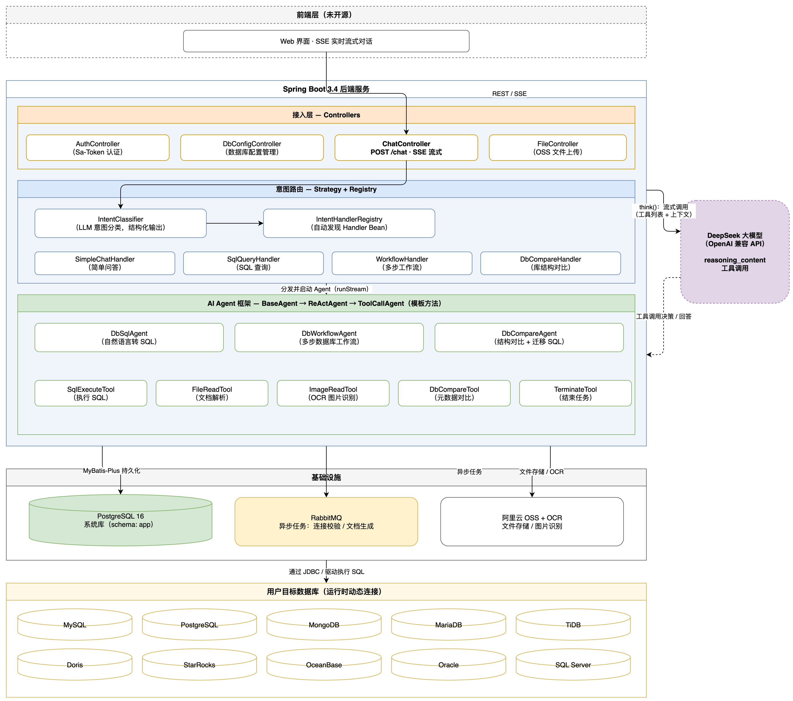
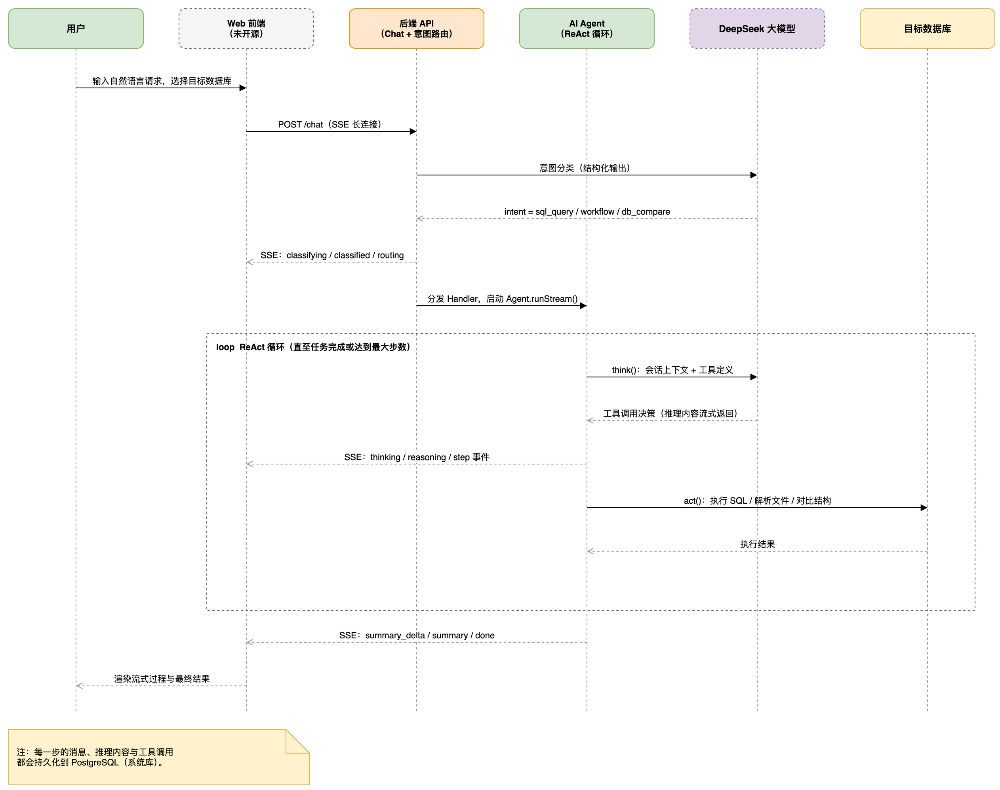

# DB-Genius — AI 数据库大师

[English](README.md) | **中文文档**

> 用自然语言对话数据库:查询、导入、对比 —— 一个网页全部搞定。

DB-Genius 是一个开源的、由 AI Agent 驱动的数据库工作台。它把自然语言转成 SQL、执行多步骤数据库工作流、为发版生成迁移 SQL、并把上传文件自动导入数据库 —— 而且可以**同时面对多个异构的大型数据库**。

---

## 一、项目介绍

### 解决的痛点

同时维护多个大型数据库、而且**引擎各不相同**(MySQL、PostgreSQL、Oracle、SQL Server、Doris……)的团队,每天都在交同样的税:

- **上下文切换**:每种引擎都有自己的客户端、方言和账号,回答一个业务问题要在五六个工具之间来回跳。
- **发版风险**:上线前要人工对比 pre 库和线上正式库的结构差异,手写迁移 SQL —— 慢、易错、还不敢全信。
- **数据录入**:业务数据以 Excel/CSV 甚至截图的形式到来,把它们变成 `CREATE TABLE` + `INSERT` 脚本是纯体力活。

### DB-Genius 能做什么

DB-Genius 把这一切收敛到**一个网页上的一个对话框**:

| 能力 | 你可以这样说 | 系统会做什么 |
|------|--------------|--------------|
| 自然语言查 SQL | "上周下了多少单?" | AI Agent 生成 SQL,在选中的数据库上执行,并流式返回结果与解释。 |
| 多库统一控制 | "对比 A 库和 B 库的 user 表" | 一个会话可以同时操作多个不同类型的目标数据库。 |
| 发版对比 + 迁移 SQL | "对比 pre 库和正式库,给我迁移脚本" | 对比 Agent 抽取两侧元数据、diff 结构,生成可直接用于发版的迁移 SQL 文档。 |
| 文件自动导入 | "把这个 Excel 导成一张新表" | 上传文件(或图片,支持 OCR),工作流 Agent 解析后生成并执行导入 SQL。 |

所有过程都通过 **SSE** 实时流式推送到浏览器 —— 每一步推理、每一次工具调用、每一条 SQL 结果,都看得见。

### 技术架构图



几个关键设计:

- **两种数据库角色**。PostgreSQL 16 是*系统库*(用户、数据库配置、会话,schema 为 `app`);用户管理的*目标库*在运行时通过 `DbType` + `DatabaseAdapter` 注册表动态连接。
- **LLM 意图路由**。`IntentClassifier`(LLM 结构化输出)→ `IntentHandlerRegistry`(Strategy + Registry,自动发现 `IntentHandler` Bean)。新增意图 = 新增一个 Bean。
- **模板方法 Agent 框架**。`BaseAgent → ReActAgent → ToolCallAgent`,具体实现 `DbSqlAgent`、`DbWorkflowAgent`、`DbCompareAgent`。`think()` 把模型推理以 SSE `reasoning` 事件流式推送,`act()` 真正执行工具。
- **异步骨干**。RabbitMQ 承载异步连接校验与表结构文档生成;阿里云 OSS 存储上传文件;数据库密码使用 AES-256-GCM 加密。

### 支持的目标数据库

| 类型 | `dbType` | 说明 |
|------|----------|------|
| MySQL | `mysql` | |
| PostgreSQL | `postgresql` | |
| MongoDB | `mongodb` | 非 SQL,JSON 命令 |
| MariaDB | `mariadb` | MySQL 协议 |
| TiDB | `tidb` | MySQL 协议 |
| Doris | `doris` | MySQL 协议(FE 端口 9030) |
| StarRocks | `starrocks` | MySQL 协议(FE 端口 9030) |
| OceanBase | `oceanbase` | MySQL 模式租户 |
| Oracle | `oracle` | `dbName` 填服务名 |
| SQL Server | `sqlserver` | 元数据覆盖 `dbo` schema |

新增一种数据库 = 加一个 `DbType` 枚举值 + 实现一个 `DatabaseAdapter` Bean(JDBC 类型继承 `AbstractJdbcAdapter`)+ 引入驱动依赖,注册表会自动发现。

### 技术栈

Spring Boot 3.4 · Spring AI 1.0 · JDK 21 · DeepSeek(OpenAI 兼容 API)· MyBatis-Plus · Sa-Token · PostgreSQL 16 · RabbitMQ 3.13 · 阿里云 OSS / OCR

---

## 二、业务流程介绍



### 流程详解

1. **发起请求**。用户在 Web 界面输入自然语言请求并选择目标数据库,前端通过统一入口 `POST /chat` 建立 SSE 长连接。
2. **意图分类**。后端调用 LLM 做结构化分类:`simple_chat`(简单问答)、`sql_query`(SQL 查询)、`workflow`(多步工作流)、`db_compare`(库对比)。如果置信度低或前置条件缺失(比如没选数据库),服务端发出 `clarify` 事件并结束流,前端展示选项后携带 `confirmedIntent` 再次请求。
3. **路由分发**。`IntentHandlerRegistry` 把请求分发给对应的 Handler,构建相应的 Agent(`DbSqlAgent` / `DbWorkflowAgent` / `DbCompareAgent`)并启动,同时分配请求级 `taskId`(通过 MDC 贯穿全部日志)。
4. **ReAct 循环**。Agent 重复 `think()` + `act()`,直到任务完成或达到最大步数:
   - `think()` —— 携带会话上下文和工具列表调用 LLM,推理内容以 `reasoning` 事件流式推给前端;
   - `act()` —— 真正执行工具:在目标库上执行 SQL、读取上传文件、OCR 图片、抽取并对比元数据;
   - 每次工具结果以 `step` 事件推送,用户可以全程"看着 Agent 干活"。
5. **总结输出**。最终答案以 Markdown 形式的 `summary_delta` 事件流式输出(打字机效果),并由权威的 `summary` 事件收尾,最后发送 `done` 结束流。
6. **消息落库**。用户消息、Agent 每一步的 assistant 消息、推理内容、工具调用结果都会持久化到 PostgreSQL 系统库,会话可以随时重开、回放。

### SSE 事件协议

所有事件均为如下 JSON:

```json
{
  "taskId": "uuid",
  "step": 1,
  "type": "classifying | classified | clarify | routing | thinking | reasoning | content | sql | result | error | file_parsed | step | summary_delta | summary | aborted | done",
  "content": "...",
  "timestamp": 1719648000000
}
```

| 类型 | 含义 |
|------|------|
| `classifying` / `classified` | 意图分析开始 / 分类结果 |
| `clarify` | 置信度低或前置条件缺失,前端展示选项并携带 `confirmedIntent` 重发 |
| `routing` | 已分发到某个 Handler |
| `thinking` / `reasoning` | Agent 分析中 / 模型推理流式内容 |
| `content` | 简单问答的流式文本 |
| `step` | ReAct 循环中一次工具执行结果 |
| `summary_delta` / `summary` | 最终 Markdown 流式增量 / 权威全文 |
| `aborted` | 用户主动终止,半截输出已落库为 `message.type = aborted`,可在历史记录中回放 |
| `error` / `done` | 错误详情 / 流结束 |

完整的 REST + SSE 接口契约见 [`api-docs.yaml`](api-docs.yaml)(OpenAPI 3)。

---

## 三、部署

### 3.1 一键部署(Docker Compose 全栈)

[`deploy/standalone/`](deploy/standalone) 目录提供全栈编排,**PostgreSQL、RabbitMQ、应用**一次全部拉起:

```bash
git clone https://github.com/spcodhu/db-genius.git && cd db-genius

# 1. 配置
cp deploy/standalone/.env.example deploy/standalone/.env
#    编辑 deploy/standalone/.env(至少填写:DB_GENIUS_DEFAULT_MODEL_API_KEY、
#    DB_GENIUS_ENCRYPT_KEY —— 必须恰好 32 位 —— 以及阿里云 OSS 相关配置)

# 2. 启动(在 Docker 内用 Maven 构建镜像,本机无需安装 JDK)
docker compose -f deploy/standalone/docker-compose.yml up -d --build
```

首次启动时,PostgreSQL 容器会通过 `docker-entrypoint-initdb.d` 自动用 `db-genius-web/src/main/resources/db/schema.sql` 初始化 `app` schema 和全部表;应用启动时会自动写入默认管理员账号。

- 后端 API:`http://localhost:8109/api`
- 默认管理员:`admin` / `admin123`
- RabbitMQ 管理台:`http://localhost:15672`

常用命令(在仓库根目录执行):

```bash
docker compose -f deploy/standalone/docker-compose.yml logs -f app   # 查看后端日志
docker compose -f deploy/standalone/docker-compose.yml ps           # 查看状态
docker compose -f deploy/standalone/docker-compose.yml down         # 停止(加 -v 连数据卷一起删除)
```

### 3.2 自定义部署(使用你自己的 PostgreSQL)

如果你的 PostgreSQL 是单独部署的(我们自己的生产环境就是这样),可以使用根目录的 [`docker-compose.yml`](docker-compose.yml):只启动 `app` + `rabbitmq`,通过 `SPRING_DATASOURCE_URL` 指向外部数据库(注意必须带 `?currentSchema=app`):

```bash
cp .env.example .env   # 填写外部 PostgreSQL 的 JDBC URL 等
docker compose up -d --build
```

或者裸机运行(需要 JDK 21):

```bash
./mvnw clean package -DskipTests
export $(cat .env | xargs)
java -jar db-genius-web/target/db-genius-web-1.0.0.jar
```

面向生产服务器的裸机/镜像部署脚本在 [`deploy/`](deploy) 目录(`build-docker.sh`、`build-local.sh`)。

### 3.3 关于前端

> **前端代码暂未开源。** 后端是一套完整、自描述的 REST + SSE API,你完全可以基于 [`api-docs.yaml`](api-docs.yaml) 开发自己的前端 —— 任何支持 SSE 的客户端都可以接入。
>
> - 需要**全程托管**(前端 + 后端部署、升级维护都交给我们)?请联系 **uguwkw@gmail.com**。
> - 想先体验一下?在线试用地址:**https://db-genius.com/**。

---

## 四、开源协议与贡献

### 开源协议

DB-Genius 基于 [MIT License](LICENSE) 开源 —— 这是最宽松的开源协议之一:**允许免费商用**、修改、分发和私有使用,唯一义务基本只是保留版权声明。

### 欢迎贡献

Issue 和 PR 都非常欢迎,这个项目会和社区一起成长。

- **Bug 反馈 / 功能建议**:提 Issue,附上最小复现步骤或清晰的使用场景。
- **Pull Request**:fork 仓库、开特性分支、保持改动聚焦,并在 PR 描述里写清楚"为什么"。特别欢迎两类贡献:新的数据库适配器(`DbType` + `DatabaseAdapter`)和新的意图 Handler(`IntentHandler`)—— 它们在设计上就是插件点。
- **咨询 / 商业支持**:uguwkw@gmail.com

感谢每一位贡献代码、文档、翻译和反馈的朋友!
