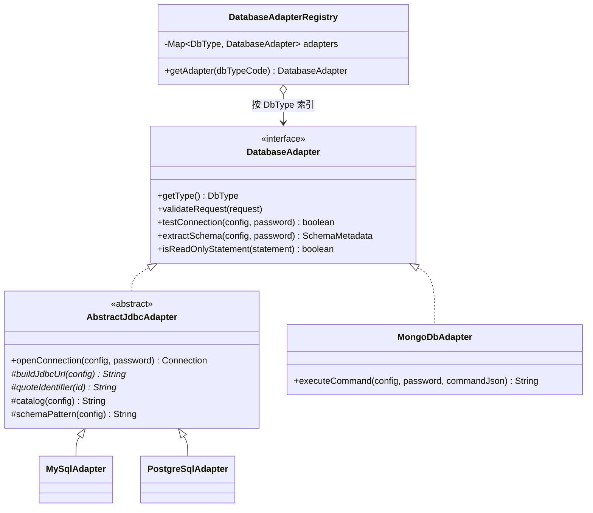
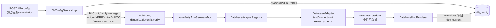
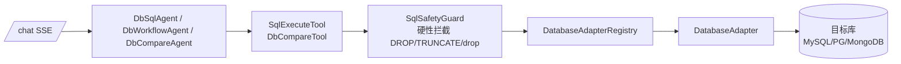
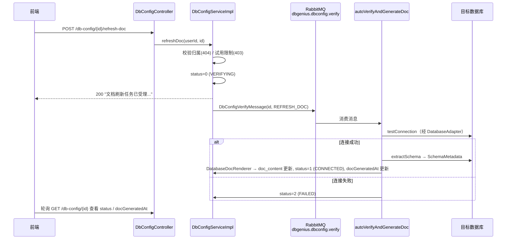
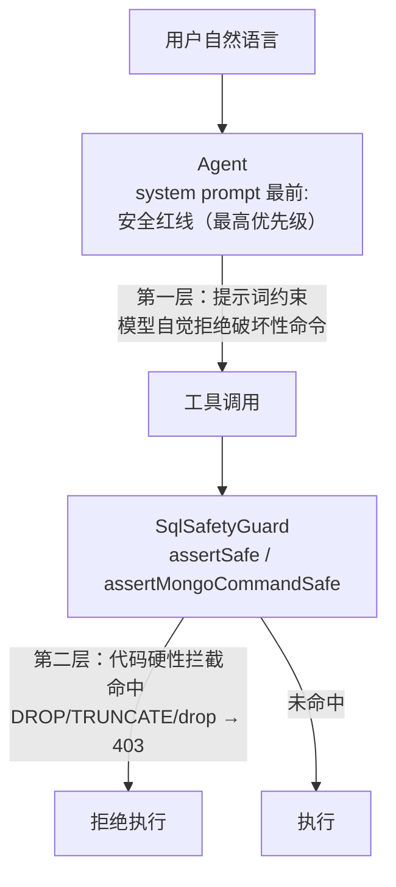

# 多数据库支持设计文档

## 1. 背景与目标

系统原先仅支持 MySQL 作为目标数据库。本次迭代将目标库能力扩展为三种类型，并围绕「结构感知」与「安全执行」补齐配套能力：

- **三种目标数据库类型**：`mysql`（默认）、`postgresql`、`mongodb`。
  各类型必填项不同（见方言差异速查表），`DbConfigRequest` DTO 已放宽固定校验，
  由 `DatabaseAdapter.validateRequest` 按类型校验，校验失败返回 400。
- **手动刷新文档**：新增 `POST /api/db-config/{id}/refresh-doc`，数据库结构变更后
  异步重新验证连接并重新生成 Markdown 文档。
- **跨类型对比**：`DbCompareTool.compareDatabases` 支持三种类型任意两两对比
  （含跨类型，如 MySQL vs PostgreSQL），基于中性元数据模型 diff，输出 JSON 结构不变。
- **安全红线**：`SqlSafetyGuard` 硬性拦截 DROP/TRUNCATE 与 MongoDB drop/dropDatabase；
  三个 Agent 的 system prompt 最开头插入「安全红线（最高优先级）」块，形成双层防护。

## 2. 总体架构

### 2.1 类层次



### 2.2 两条主调用链

**配置 → MQ → 适配器 → 渲染器（文档生成链路）：**



**chat → 工具 → 适配器（AI 执行链路）：**



上层 `DbConfigServiceImpl` / `SqlExecuteTool` / `DbCompareTool` 全部面向 `DatabaseAdapter`
抽象编程，不再出现按数据库类型的 if-else 分派。

### 2.3 核心组件清单

| 组件 | 位置 | 职责 |
|------|------|------|
| `DbType` | `com.dbgenius.model.enums` | 类型标识（code 入库，`fromCode` 解析，null/空白回退 mysql） |
| `SchemaMetadata` / `TableMetadata` / `ColumnMetadata` / `IndexMetadata` | `com.dbgenius.model.metadata` | 中性元数据模型，跨方言统一视图 |
| `DatabaseAdapter` | `com.dbgenius.service.database` | 策略模式接口（SPI） |
| `AbstractJdbcAdapter` | `com.dbgenius.service.database` | JDBC 系模板方法基类 |
| `MySqlAdapter` / `PostgreSqlAdapter` | `com.dbgenius.service.database` | JDBC 系具体策略 |
| `MongoDbAdapter` | `com.dbgenius.service.database` | 非 JDBC 直接实现接口 |
| `DatabaseAdapterRegistry` | `com.dbgenius.service.database` | 注册表，Spring 自动收集全部 adapter Bean |
| `DatabaseDocRenderer` | `com.dbgenius.service.database` | SchemaMetadata → Markdown，格式与历史逐字符一致 |
| `SqlSafetyGuard` | `com.dbgenius.common.util` | 破坏性命令统一拦截点 |

## 3. 设计模式详解

### 3.1 策略模式（DatabaseAdapter）

每种数据库类型对应一个策略实现（Spring Bean），把「连接测试、Schema 元数据抽取、
只读判断、配置校验」等因库而异的行为收敛到统一契约之后。上层只持有
`DatabaseAdapterRegistry`，按 `DbType` 取策略，彻底消除类型分派。

### 3.2 模板方法模式（AbstractJdbcAdapter）

MySQL / PostgreSQL 都通过 JDBC 访问，「打开连接 → 遍历表 → 抽取列/主键/索引
→ 组装中性元数据」主流程完全一致，固化为模板方法（`testConnection`、`extractSchema`）；
方言差异下沉为钩子方法：

| 钩子方法 | 默认实现 | MySQL | PostgreSQL |
|----------|----------|-------|------------|
| `buildJdbcUrl` | （抽象，必须实现） | `jdbc:mysql://host:port/dbName?useSSL=false&...` | `jdbc:postgresql://host:port/dbName` |
| `quoteIdentifier` | （抽象，必须实现） | 反引号 `` ` `` | 双引号 `"` |
| `catalog` | `dbName` | `dbName` | 覆盖 |
| `schemaPattern` | `null` | `null` | `"public"` |

`quoteIdentifier` 设计为抽象方法是刻意的：强制每种方言显式声明引号，避免默认引号
在新方言下静默出错。`openConnection` 同时作为 agent 模块 `SqlExecuteTool` 执行 SQL 的
统一连接入口，走账密认证。

### 3.3 注册表模式（DatabaseAdapterRegistry）

构造期由 Spring 注入全部 `DatabaseAdapter` Bean，按 `DbType` 建立不可变索引
（`EnumMap`）。同一类型重复注册会在启动期直接抛错（快速失败）。

**新增数据库三步走（开闭原则）：**

1. `DbType` 加一个枚举值（code / displayName / 是否 SQL 系）；
2. 新建 adapter 实现类并标注 `@Component`——JDBC 系继承 `AbstractJdbcAdapter`
   只需实现少量钩子，非 JDBC 直接实现 `DatabaseAdapter`；
3. 完成。注册表自动收集，无需修改任何既有代码。

### 3.4 适配器模式（中性元数据模型）

`SchemaMetadata` / `TableMetadata` / `ColumnMetadata` / `IndexMetadata` 是跨方言的
统一视图：文档生成（`DatabaseDocRenderer`）与库间对比（`DbCompareTool` 的 diff）都消费
这一模型，不感知底层方言。MongoDB 侧把「集合即表、采样推断字段」适配进同一模型。
未来接入向量数据库时，只要实现同一 SPI（`DatabaseAdapter`）并把其元数据适配到中性
模型，文档与对比能力即刻可用。

### 3.5 门面 / 守卫（SqlSafetyGuard 双层防护）

`SqlSafetyGuard` 是所有「AI 工具执行数据库语句」入口的统一守卫（门面）：

- **第一层：提示词约束**——三个 Agent（DbSqlAgent / DbWorkflowAgent / DbCompareAgent）
  的 system prompt 最开头插入「安全红线（最高优先级）」块，声明即使用户明确要求也
  拒绝破坏性命令；
- **第二层：代码强制**——`SqlExecuteTool.executeSql` 与 `MongoDbAdapter.executeCommand`
  在执行前调用 `assertSafe` / `assertMongoCommandSafe`，命中即抛 403 业务异常。

即使大模型被提示注入绕过第一层，代码层依然兜底。

## 4. 各方言差异速查表

| 维度 | MySQL | PostgreSQL | MongoDB |
|------|-------|------------|---------|
| URL 模板 | `jdbc:mysql://host:port/db?useSSL=false&allowPublicKeyRetrieval=true&serverTimezone=UTC` | `jdbc:postgresql://host:port/db` | `mongodb://[user:pwd@]host:port/`（密码 URL 编码） |
| catalog | `dbName` | 覆盖（非 dbName 定位） | 无此概念 |
| schemaPattern | `null` | `"public"`（PG 的表在 schema 下） | 无此概念 |
| 标识符引号 | 反引号 | 双引号 | 无此概念 |
| 认证 | 账密 | 账密 | 账密可空（支持无认证部署） |
| 配置必填项 | host+port+dbName+username+password | host+port+dbName+username+password | host+port+dbName |
| 只读前缀 | SELECT/SHOW/DESC/EXPLAIN | 同左 | find/count/distinct 恒只读；aggregate 不含 $out/$merge 才只读 |
| 元数据关键决策 | 行数 `SELECT COUNT(*)` | 同左 | 集合即表；采样 50 文档合并 key 推断字段；`estimatedDocumentCount` 行数；`listIndexes` 索引 |

MongoDB 补充说明：文档型库无固定 Schema，采样结果仅供 LLM 参考，不保证覆盖所有字段；
字段一律视为可空，字段名 `_id` 视为主键。

## 5. 手动刷新文档接口

`POST /api/db-config/{id}/refresh-doc`：数据库结构变更后手动触发「重新验证 + 刷新文档」。
异步受理，立即返回提示文案；与既有的 `POST /{id}/generate-doc`（同步生成并返回内容）
互补，后者保留不变。



`DbConfigVerifyMessage` 新增 `action` 分量：`VERIFY_AND_DOC`（默认，创建/更新后触发）
与 `REFRESH_DOC`（手动刷新触发），两种动作的消费逻辑一致，仅用于日志与语义区分。
文档仍写入 `db_config.doc_content`，Markdown 格式与历史完全一致。

## 6. 安全红线设计

### 6.1 拦截规则

| 通道 | 拦截内容 | 实现 |
|------|----------|------|
| SQL 系（MySQL/PG） | DROP / TRUNCATE 一切变体（含 DROP TABLE、DROP DATABASE、ALTER TABLE ... DROP COLUMN） | 剥离 `--` 行注释、`/* */` 块注释、单/双引号字面量后做词边界匹配（忽略大小写），命中抛 403 |
| MongoDB | 裸命令形态的 drop / dropDatabase | 同样剥离注释与字面量后词边界匹配，命中抛 403 |
| MongoDB 兜底 | 非 find/count/distinct/aggregate 的操作一律拒绝；aggregate 管道含 $out/$merge 拒绝 403 | 操作白名单 + 管道只读断言 |

### 6.2 双层防护



提示词块置于 system prompt **最开头**并标注「最高优先级」，是因为大模型对上下文前部
的指令遵循度最高，且能抵抗后续用户消息中的指令覆盖（提示注入）。但提示词约束本质
是概率性的，所以代码层拦截是确定性兜底，两层缺一不可。

另外：`DbCompareAgent` 生成的部署 SQL 仅作报告输出，不通过 `executeSql` 执行，
不进入执行通道。

## 7. MongoDB 的 AI 执行通道

`SqlExecuteTool.executeSql(dbConfigId, sql)` 对 mongodb 类型接受 JSON 命令：

```json
{
  "collection": "users",
  "operation": "find | count | distinct | aggregate",
  "filter": {"age": {"$gt": 18}},
  "field": "city",
  "pipeline": [{"$group": {"_id": "$city", "n": {"$sum": 1}}}],
  "limit": 100
}
```

- `find` 返回文档数组，limit 缺省 100 且硬性钳制在 [1, 100]；
- `count` 返回数字；`distinct` 需 `field`，返回 `{"values": [...]}`；
- `aggregate` 需 `pipeline`，含 `$out` / `$merge` 拒绝 403；
- 执行前经 `SqlSafetyGuard.assertMongoCommandSafe` 硬性拦截 drop 类操作。

## 8. 测试样例

关键单元测试：

| 测试类 | 覆盖点 |
|--------|--------|
| `SqlSafetyGuardTest`（db-genius-common） | DROP/TRUNCATE 命中；注释内的 drop 不误伤；字符串字面量内的 'drop' 不误伤；MongoDB drop/dropDatabase 命中 |
| `MySqlAdapterTest` / `PostgreSqlAdapterTest` / `MongoDbAdapterTest`（db-genius-service） | URL 模板逐字符断言、catalog/schemaPattern、标识符引号、validateRequest 正反例（缺 host/port/密码抛 400）、只读判断 |
| `DatabaseAdapterRegistryTest`（db-genius-service） | 按类型取策略、历史数据回退 mysql、不支持的类型抛 400 |
| `DatabaseDocRendererTest`（db-genius-service） | Markdown 输出与历史格式逐字符兼容 |
| `SqlExecuteToolTest`（db-genius-agent） | 安全拦截用例（DROP/TRUNCATE 拒绝）、MongoDB 命令委托给 `MongoDbAdapter.executeCommand` |

代表性测试片段（`MySqlAdapterTest`，URL 模板防漂移）：

```java
@Test
void URL模板与现网保持一致() {
    // 该 URL 模板含现网在用的全部参数，任何漂移都应被本测试拦住
    assertEquals("jdbc:mysql://localhost:3306/testdb?useSSL=false&allowPublicKeyRetrieval=true&serverTimezone=UTC",
            adapter.buildJdbcUrl(config()));
}

@Test
void 校验失败_缺host抛400() {
    DbConfigRequest request = validRequest();
    request.setHost(null);
    BusinessException ex = assertThrows(BusinessException.class, () -> adapter.validateRequest(request));
    assertEquals(400, ex.getCode());
}
```

运行全部测试：

```bash
./mvnw test
```

## 9. 兼容性与边界

- **文档格式逐字符兼容**：`DatabaseDocRenderer` 输出的 Markdown 与历史 MySQL 文档格式
  完全一致，由 `DatabaseDocRendererTest` 保障；MySQL 的 JDBC URL 模板与现网逐字符一致，
  由 `MySqlAdapterTest` 保障。
- **既有前端接口不变**：`dbType` 缺省 mysql；`db_config.db_type` 列存小写 code，历史数据
  （无 dbType 概念）经 `DbType.fromCode` 统一回退为 mysql；既有端点路径与语义均不变。
- **AesUtil 空密码处理**：MongoDB（密码可空）配置入库时密文存 null，
  解密侧对 null/空白直通，不做加解密。
- **已知边界：MongoDB JSON 形态的 drop**——MongoDB 的删除操作可通过正常 JSON 命令
  表达（如 `{"operation":"drop"}`），这类形态不依赖关键字扫描，由**操作白名单**兜底：
  非 find/count/distinct/aggregate 一律拒绝，因此 drop 操作无法进入执行逻辑。
- **试用版**：`sql_query` 意图的只读限制按方言判断（`isReadOnlyStatement`），
  MongoDB 的 find/count/distinct 视为只读。
- **SQLite 支持已移除**：SQLite 曾作为第四种类型接入（`dbName` 即文件路径、无账密）。
  因其为嵌入式库、不支持远程连接，与 SaaS 形态（用户无法把文件放到服务端）不符；
  且 xerial 驱动默认 `READWRITE|CREATE` 打开，配置路径不存在时会在服务端误建空文件
  并误报"连接成功"。综合需求与安全考虑已整体移除（枚举、适配器、驱动依赖、
  文档）。`db_config` 表中如残留 `db_type='sqlite'` 的历史行，会按不支持类型
  在 `DbType.fromCode` 处抛 400。
