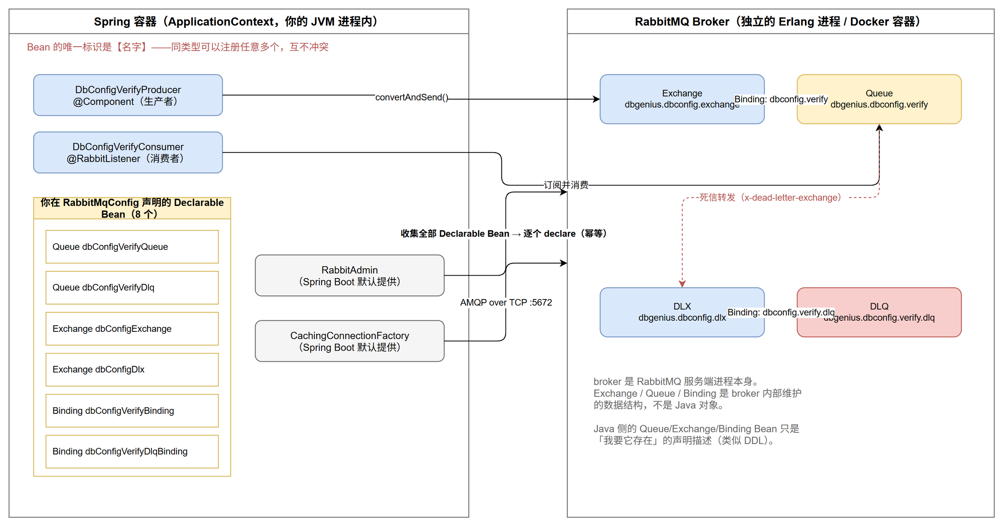
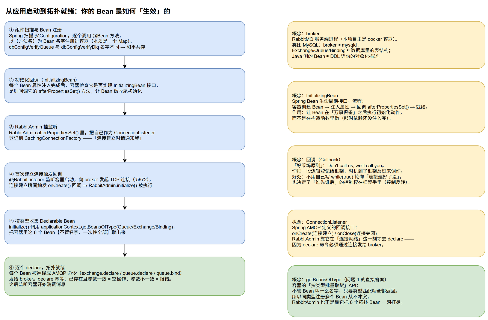

# RabbitMQ 与 Spring 的协作机制：从小白到看懂 RabbitMqConfig

> 配套代码：`db-genius-service/src/main/java/com/dbgenius/mq/RabbitMqConfig.java`
> 本文回答两个问题：
> 1. 为什么 `Queue`、`Exchange` 等同类型 Bean 可以注册多个而不冲突？
> 2. broker、`InitializingBean`、回调（Callback）这些概念到底是什么，它们如何串成一条链路？

## 一、先建立世界观：东西分别活在哪

看图之前先记住一句话：**你写的 Java 对象和 RabbitMQ 里的队列，是两个世界的东西**。



- 左边是 **Spring 容器（ApplicationContext）**：你的 JVM 进程内存里的一个" Bean 仓库"。本质上可以把它想象成一个 `Map<String, Object>`——key 是 Bean 的名字，value 是 Bean 实例。
- 右边是 **RabbitMQ broker**：一个独立运行的服务端进程（本项目里是 docker 容器，Erlang 写的）。Exchange、Queue、Binding 是 **broker 内部维护的数据结构**，存在于 broker 的内存/磁盘里，跟你的 JVM 没有半点关系。
- 两个世界之间唯一的桥梁是 **AMQP 协议 over TCP 连接（5672 端口）**。

类比 MySQL 会非常好懂：

| RabbitMQ 世界 | MySQL 世界 |
|---|---|
| broker | mysqld（数据库服务进程） |
| Exchange / Queue / Binding | 表 / 索引 / 外键等库内数据结构 |
| Java 侧的 `Queue`/`Exchange` Bean | DDL 语句的对象化描述（"我要这样一张表"） |
| `RabbitAdmin.declare()` | 执行 `CREATE TABLE IF NOT EXISTS` |

所以 `RabbitMqConfig` 里那些 `@Bean` 方法创建的 `Queue` 对象，**本身什么都做不了**——它们只是"声明描述"，记录了名字、durable、死信参数。真正让它们生效的，是有人把这份描述翻译成 AMQP 命令发给 broker。这个人就是 `RabbitAdmin`。

## 二、问题 1：同类型 Bean 为什么能注册多个而不冲突

### Bean 的唯一标识是"名字"，不是"类型"

Spring 容器注册 Bean 时，以 **Bean 名字** 作为唯一 key（`@Bean` 方法默认用方法名）。类型只是实例的"属性"，不是身份证。

```java
@Bean
public Queue dbConfigVerifyQueue() { ... }   // 名字 = "dbConfigVerifyQueue"

@Bean
public Queue dbConfigVerifyDlq() { ... }     // 名字 = "dbConfigVerifyDlq"
```

这就好比一个 Map 里放两个人：

```java
map.put("dbConfigVerifyQueue", queue1);   // key 不同，互不干扰
map.put("dbConfigVerifyDlq", queue2);
```

冲突只会发生在**同名**注册时（而且 Spring Boot 默认会直接报错 `BeanDefinitionOverrideException`，把问题暴露出来，不会静默覆盖）。

### 那 `@ConditionalOnMissingBean` 会不会误伤？

不会。上一轮的解释里提到它，它是**自动配置类**专用的"退让开关"，语义是："容器里已经有这个类型的 Bean 了吗？有的话我这份默认实现就不注册了。"它只在"默认实现要不要上岗"这个决策点上起作用，**从不删除或阻止你已注册的 Bean**。而且它针对的是 `RabbitTemplate`、`rabbitListenerContainerFactory` 这类"全应用只需要一份"的基础设施 Bean——Spring Boot 根本不会为 `Queue`/`Exchange` 提供任何默认 Bean（它猜不到你的业务拓扑），所以这里连退让判断都不存在。

### RabbitAdmin 如何一次性收走 8 个 Bean

靠容器的"按类型批量取货"API：

```java
Map<String, Queue> queues = applicationContext.getBeansOfType(Queue.class);
// → {"dbConfigVerifyQueue": ..., "dbConfigVerifyDlq": ...}
```

`getBeansOfType` 不看名字，把类型匹配的全部返回。这就是为什么：

- 你注册几个都行——名字区分，容器照单全收；
- `RabbitAdmin` 不需要知道你的 Bean 叫什么——按类型一网打尽。

## 三、问题 2：概念逐个击破

### broker

就是 RabbitMQ 服务端进程本身。"消息中间件"这个词里的"中间"说的就是它——它站在生产者和消费者中间，替双方保管和转发消息。生产者把消息发给 broker，消费者从 broker 取消息，双方互不见面、不需要同时在线。这也是 MQ 能"削峰、解耦、异步"的根本原因。

### Spring Bean 生命周期与 InitializingBean

一个 Bean 在容器里的完整旅程：

```
1. 实例化        new RabbitAdmin(...)          ← 此时字段都是 null
2. 属性注入      把 ConnectionFactory 等依赖塞进来
3. 初始化回调    如果实现了 InitializingBean → 调用 afterPropertiesSet()
4. 就绪          放入容器，供别人注入使用
... 应用关闭 ...
5. 销毁回调      如果实现了 DisposableBean → 调用 destroy()
```

为什么需要第 3 步？因为**构造函数里做不了完整的初始化**——`new` 的时候依赖还没注入（第 2 步还没发生）。Spring 约定：如果你需要在"依赖全部就位后"做点什么（比如建立连接、注册监听器），就实现 `InitializingBean.afterPropertiesSet()`，容器保证在正确的时机调用它。

### 回调（Callback）：好莱坞原则

回调是一种编程模式：**你不调用框架，框架在合适的时机调用你**（"Don't call us, we'll call you"）。

没有回调的世界，你得自己轮询：

```java
// 反模式：傻等
while (!connectionFactory.isConnected()) {
    Thread.sleep(100);
}
doDeclare();  // 连接好了才执行
```

有回调的世界：

```java
connectionFactory.addConnectionListener(new ConnectionListener() {
    @Override
    public void onCreate(Connection connection) {
        doDeclare();  // 连接建立的那一刻，框架自动调这里
    }
});
// 你的代码到此结束，剩下的事交给框架
```

`RabbitAdmin` 用的就是第二种。它没法预知连接什么时候建立（网络可能抖动、broker 可能重启），于是把"建立后要做的事"（declare 拓扑）登记为监听器回调，然后就去干别的了。

### 幂等（Idempotent）的 declare

AMQP 协议规定：declare 操作重复执行是安全的。

- 队列不存在 → 创建；
- 已存在且参数完全一致 → 什么都不做，返回成功；
- 已存在但参数**不一致**（比如你改了死信配置）→ 直接报错。

这就是为什么应用每次启动都全量 declare 一遍也不会出问题，也是为什么改 `RabbitMqConfig` 里的队列参数后，要记得先去管理界面删掉旧队列，否则启动会报错。

## 四、串起来：从启动到就绪的完整时序



文字版（对应图中 ①~⑥）：

1. **组件扫描与 Bean 注册**：Spring 扫描到 `@Configuration` 注解的 `RabbitMqConfig`，逐个调用 8 个 `@Bean` 方法，以方法名为 key 注册进容器。`dbConfigVerifyQueue` 和 `dbConfigVerifyDlq` 名字不同，和平共存。
2. **初始化回调**：每个 Bean 属性注入完成后，容器检查它是否实现了 `InitializingBean`，是则回调 `afterPropertiesSet()`。
3. **RabbitAdmin 挂监听**：`RabbitAdmin`（Spring Boot 默认提供的 Bean）在自己的 `afterPropertiesSet()` 里，把自己作为 `ConnectionListener` 登记到 `CachingConnectionFactory`——"连接建立时请通知我"。
4. **首次建立连接触发回调**：`@RabbitListener` 的监听容器启动，需要连接 broker 才能消费，于是发起 TCP 连接。连接建立瞬间触发 `onCreate()` → `RabbitAdmin.initialize()` 被执行。
5. **按类型收集**：`initialize()` 调用 `getBeansOfType()`，把容器里所有 `Queue`/`Exchange`/`Binding` Bean 一次性取出（不管名字）。
6. **逐个 declare**：每个 Bean 被翻译成 AMQP 命令（`exchange.declare` / `queue.declare` / `queue.bind`）通过连接发给 broker，幂等执行。拓扑就绪，监听容器开始消费消息。

注意一个精妙的设计：**declare 动作被推迟到"连接建立"这个事件上**，而不是启动时硬执行。这样即使启动时 broker 还没起好（docker compose 里两个容器同时启动的常见情况），应用也不会崩——连接工厂会不断重连，哪次连上了，哪次就触发 declare。

## 五、一页纸总结

- **Bean 不冲突**：容器按名字索引 Bean，同类型随便注册；`RabbitAdmin` 用 `getBeansOfType` 按类型批量收集。
- **Java Bean ≠ broker 实体**：Bean 只是声明描述，`RabbitAdmin` 负责翻译成 AMQP 命令让 broker 创建真实结构。
- **生效时机**：不是"注册 Bean 时"，而是"首次 AMQP 连接建立时"，由 `ConnectionListener.onCreate` 回调驱动。
- **健壮性来源**：declare 幂等 + 连接失败自动重连 + 重连后重新 declare。
